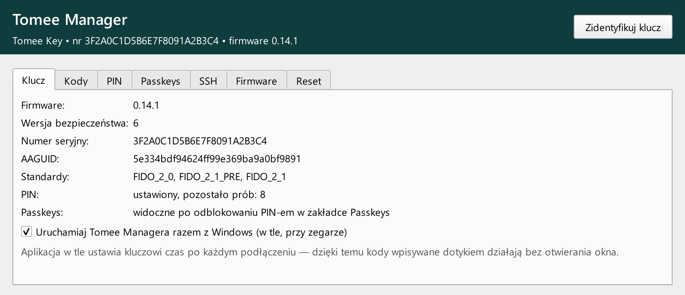
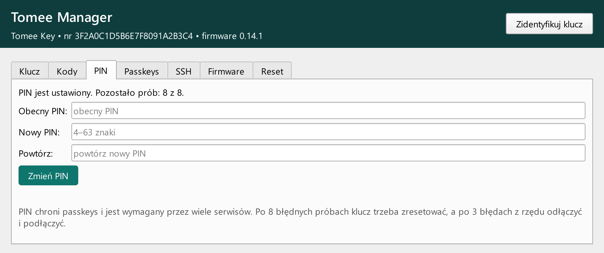
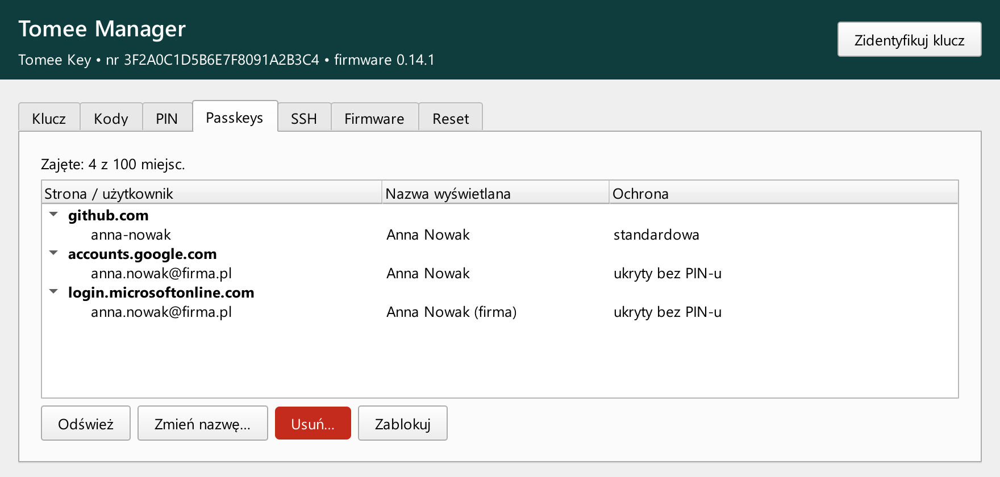
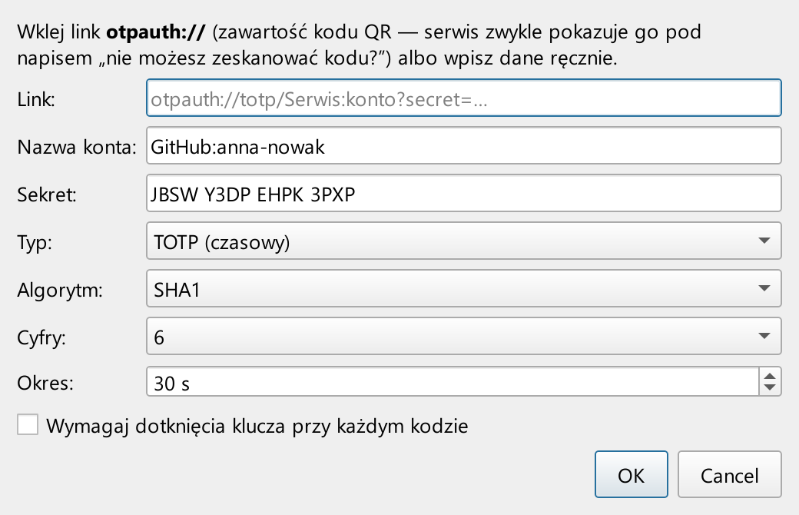
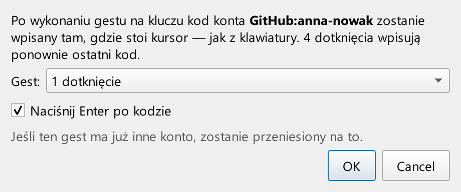
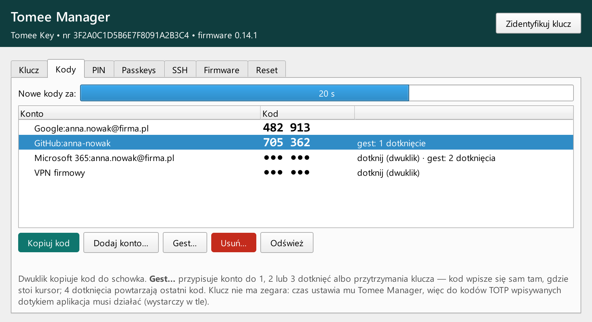
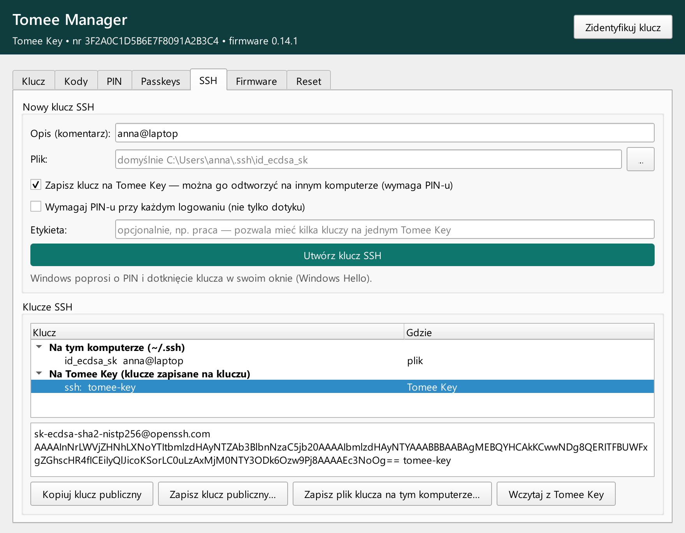
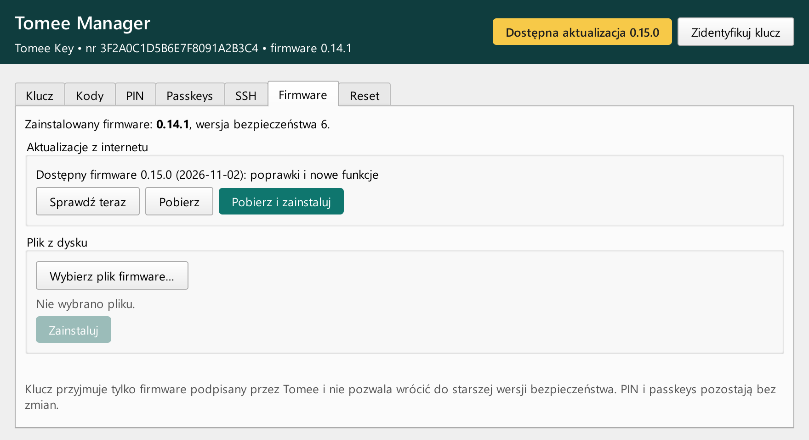

# Tomee Key — instrukcja użytkownika

<!-- okladka: docs/img/kody.png -->

**Tomee Key** to sprzętowy klucz bezpieczeństwa USB. Zastępuje hasła i kody SMS: do serwisów
logujesz się dotykiem klucza, a tam, gdzie potrzebny jest kod jednorazowy, klucz sam go wpisuje.
Do zarządzania kluczem służy bezpłatna aplikacja **Tomee Manager** dla Windows.

> **Program pilotażowy.** Ten egzemplarz należy do serii testowej. Dodawaj Tomee Key w serwisach
> jako **dodatkowy** sposób logowania i zachowaj dotychczasowy (telefon, kody zapasowe).
> Uwagi i problemy zgłaszaj na **biuro@tomee.pl**.

*Dotyczy: firmware 0.14.1 · Tomee Manager 0.3.0 · wrzesień 2026*

## Spis treści

1. [Co potrafi Tomee Key](#1-co-potrafi-tomee-key)
2. [Technologie i bezpieczeństwo](#2-technologie-i-bezpieczeństwo)
3. [Wymagania](#3-wymagania)
4. [Pierwsze uruchomienie](#4-pierwsze-uruchomienie)
5. [Logowanie bez hasła — passkeys](#5-logowanie-bez-hasła--passkeys)
6. [Kody jednorazowe (TOTP)](#6-kody-jednorazowe-totp)
7. [Klucze SSH](#7-klucze-ssh)
8. [Aktualizacje](#8-aktualizacje)
9. [Sygnalizacja diodami](#9-sygnalizacja-diodami)
10. [Rozwiązywanie problemów](#10-rozwiązywanie-problemów)
11. [Dane techniczne](#11-dane-techniczne)
12. [Kontakt](#12-kontakt)

## 1. Co potrafi Tomee Key

- **Passkeys (FIDO2 / WebAuthn)** — logowanie bez hasła albo jako drugi składnik w Google, Microsoft, GitHub,
  Apple i setkach innych serwisów. Klucz działa w Chrome, Edge, Firefox i Safari, bez instalowania sterowników.
- **Kody jednorazowe TOTP/HOTP** — zastępuje aplikację z kodami w telefonie. Kod wpisuje się sam po dotknięciu
  klucza: każdemu kontu możesz przypisać własny gest (1, 2 lub 3 dotknięcia albo przytrzymanie).
- **Klucze SSH** — logowanie do serwerów i GitHub/GitLab kluczem sprzętowym (standard OpenSSH `sk-ecdsa`).
- **PIN** — chroni konta, gdyby klucz wpadł w niepowołane ręce.
- **Aktualizacje przez internet** — nowy firmware i nowa wersja aplikacji instalują się jednym kliknięciem.

<!-- nowa-strona -->
## 2. Technologie i bezpieczeństwo

Tomee Key opiera się na otwartych standardach branżowych, tych samych, których używają duże serwisy internetowe
i systemy operacyjne.

| Technologia | Do czego służy |
|---|---|
| **FIDO2: WebAuthn i CTAP 2.1** | logowanie passkeys w przeglądarkach i systemach; odporne na phishing, bo klucz podpisuje logowanie tylko dla prawdziwego adresu serwisu |
| **ECDSA P-256 (ES256)** | podpisy logowania; obliczane sprzętowo przez akcelerator kryptograficzny (PKA) mikrokontrolera |
| **Protokół PIN 1 i 2 (ECDH P-256, AES-256, HMAC-SHA-256)** | PIN przesyłany do klucza w postaci zaszyfrowanej |
| **Rozszerzenia hmac-secret i credProtect** | klucze szyfrowania dla menedżerów haseł; konta ukryte przed osobą, która nie zna PIN-u |
| **TOTP (RFC 6238) i HOTP (RFC 4226)** | kody jednorazowe zgodne z Google Authenticator i podobnymi aplikacjami (HMAC-SHA-1 i HMAC-SHA-256) |
| **OpenSSH `sk-ecdsa-sha2-nistp256`** | klucze SSH, których część prywatna jest związana ze sprzętem |
| **Podpisany firmware** | klucz instaluje tylko oprogramowanie podpisane cyfrowo przez Tomee (ECDSA P-256, SHA-256) |

**Jak klucz chroni Twoje konta**

- **Klucze prywatne nie opuszczają urządzenia.** Każdy passkey ma własny klucz prywatny, wyliczany wewnątrz
  Tomee Key z tajnego klucza urządzenia. Serwis dostaje tylko klucz publiczny i podpis.
- **Ochrona przed phishingiem.** Podpis logowania jest związany z domeną serwisu — fałszywa strona o podobnym
  adresie nie otrzyma ważnego podpisu.
- **Potwierdzenie obecności.** Każde logowanie wymaga fizycznego dotknięcia klucza, więc złośliwe oprogramowanie
  nie zaloguje się w Twoim imieniu po cichu.
- **Limit prób PIN-u.** Po 3 błędach z rzędu klucz trzeba odłączyć i podłączyć, a po 8 błędach blokuje się na stałe
  (odzyskanie tylko przez wyczyszczenie).
- **Sprzętowy generator liczb losowych (TRNG)** tworzy tajny klucz urządzenia i wszystkie jednorazowe wartości.
- **Sekrety kodów jednorazowych** są zapisywane w kluczu i nie da się ich z niego odczytać — klucz podaje tylko
  gotowe kody.
- **Bezpieczne aktualizacje.** Bootloader sprawdza podpis i sumę SHA-256 każdego obrazu przed instalacją
  i nie pozwala wrócić do wersji ze znanymi błędami bezpieczeństwa (ochrona przed cofnięciem wersji).
- **Osobny kanał zarządzania.** Tomee Manager komunikuje się z kluczem przez oddzielny interfejs, który nie
  pozwala logować się do serwisów. Dlatego aplikacja nie potrzebuje uprawnień administratora.
- **Wpisywanie kodów.** Klucz wpisuje wyłącznie cyfry kodu (opcjonalnie z klawiszem Enter) i tylko po
  Twoim geście.

> **Status produktu.** Tomee Key nie przeszedł jeszcze certyfikacji FIDO Alliance. W serii pilotażowej
> nie jest też włączona sprzętowa blokada odczytu pamięci — osoba z fizycznym dostępem do klucza i specjalistycznym
> sprzętem mogłaby odczytać jego zawartość. Nie przechowuj na egzemplarzu pilotażowym jedynego zabezpieczenia
> kont o krytycznym znaczeniu.

## 3. Wymagania

| | |
|---|---|
| **Tomee Manager** | Windows 10 lub 11 (64-bit), bez instalacji i bez uprawnień administratora |
| **Passkeys** | przeglądarka z WebAuthn: Chrome, Edge, Firefox, Safari — w systemach Windows, macOS i Linux |
| **Kody wpisywane dotykiem** | uruchomiony Tomee Manager (wystarczy ikona przy zegarze) — podaje kluczowi aktualny czas |
| **Klucze SSH** | OpenSSH 8.9 lub nowszy (wbudowany w Windows 11; w Windows 10 może wymagać aktualizacji OpenSSH) |
| **Połączenie** | port USB komputera; najlepiej bezpośrednio, bez rozgałęźnika |

<!-- nowa-strona -->
## 4. Pierwsze uruchomienie

1. Pobierz **Tomee Manager** (plik `.exe`) ze strony
   [github.com/crawe1/tomeekey-pub](https://github.com/crawe1/tomeekey-pub) i uruchom go. Program nie wymaga instalacji.
   Windows może pokazać „System Windows ochronił Twój komputer” — kliknij **Więcej informacji → Uruchom mimo to**
   (aplikacja nie ma jeszcze cyfrowego podpisu wydawcy).
2. Podłącz klucz. Czerwona dioda miga przez ok. 3 s — klucz się uruchamia. Po chwili w nagłówku aplikacji
   pojawi się numer seryjny i wersja firmware.
3. Zakładka **PIN** → ustaw PIN (4–63 znaki). Zapamiętaj go — po 8 błędnych próbach klucz trzeba wyczyścić.
4. Zostaw zaznaczoną opcję **Uruchamiaj Tomee Managera razem z Windows**. Aplikacja działa w tle (ikona **T**
   przy zegarze). Zamknięcie okna jej nie wyłącza — całkiem wyłączysz ją prawym klikiem na ikonie → **Zakończ**.

*Rys. 1. Zakładka Klucz: numer seryjny, wersja firmware, obsługiwane standardy i stan PIN-u.
Przycisk „Zidentyfikuj klucz” miga diodami wybranego klucza.*

*Rys. 2. Zakładka PIN: ustawienie i zmiana PIN-u oraz liczba pozostałych prób.*

## 5. Logowanie bez hasła — passkeys

Większość dużych serwisów (Google, Microsoft, GitHub, Apple, Allegro i inne) pozwala dodać klucz bezpieczeństwa.

**Dodanie klucza do serwisu**

1. W serwisie otwórz ustawienia bezpieczeństwa i wybierz **Dodaj klucz dostępu (passkey)** albo
   **Klucz bezpieczeństwa**.
2. Gdy Windows zapyta, gdzie zapisać klucz, wybierz **Klucz bezpieczeństwa / inne urządzenie**.
3. Podaj **PIN** i **dotknij klucza**, gdy zamiga zielona dioda.

**Logowanie:** wybierz klucz bezpieczeństwa, podaj PIN i dotknij klucza. Tyle.

W zakładce **Passkeys** (po podaniu PIN-u) zobaczysz wszystkie konta zapisane w kluczu. Możesz zmienić nazwę konta
albo je usunąć — usunięcie jest nieodwracalne, więc najpierw usuń klucz w ustawieniach serwisu.

*Rys. 3. Zakładka Passkeys: konta zapisane w kluczu, pogrupowane według serwisów, z poziomem ochrony.*

<!-- nowa-strona -->
## 6. Kody jednorazowe (TOTP)

Tomee Key zastępuje aplikację z kodami w telefonie (Google Authenticator, Microsoft Authenticator itp.).

**Dodanie konta**

1. W serwisie włącz uwierzytelnianie **aplikacją**. Serwis pokaże kod QR — kliknij „nie możesz zeskanować?”,
   aby zobaczyć **klucz tekstowy** (albo skopiuj link `otpauth://`).
2. Tomee Manager → zakładka **Kody** → **Dodaj konto…** → wpisz nazwę (np. `GitHub:jan`), wklej klucz tekstowy
   → **OK** → podaj PIN.
3. Kod pojawi się na liście. Wpisz go w serwisie, żeby potwierdzić. **Zapisz kody zapasowe**, które serwis pokaże
   na koniec.

> **Kopia zapasowa:** zanim potwierdzisz konto w serwisie, zeskanuj ten sam kod QR także telefonem. Telefon i klucz
> będą podawać te same kody.

*Rys. 4. Dodawanie konta. Opcja „Wymagaj dotknięcia” sprawia, że kod pojawi się dopiero po dotknięciu klucza.*

**Wpisywanie kodu dotykiem**

1. Zakładka **Kody** → zaznacz konto → **Gest…** → wybierz np. **1 dotknięcie**. Opcja **Naciśnij Enter po kodzie**
   od razu zatwierdza formularz.
2. Na stronie logowania kliknij w pole kodu i **dotknij klucza**. Kod wpisze się sam, a zielona dioda mrugnie dwa razy.

*Rys. 5. Przypisanie gestu do konta.*

| Gest | Działanie |
|---|---|
| 1, 2 lub 3 dotknięcia | wpisuje kod konta przypisanego do tego gestu |
| przytrzymanie 1,5–5&nbsp;s | gdy zielona dioda zacznie szybko migać, puść palec — wpisze się kod konta przypisanego do przytrzymania |
| 4 dotknięcia | wpisuje ostatni kod jeszcze raz (np. gdy trafił w złe pole) |

Palec trzymany dłużej niż 5 s niczego nie wpisuje, a przedmiot lub kropla wody na polu dotykowym zostaje po 10 s zignorowana — klucz nie wpisze kodu bez Twojego gestu.

*Rys. 6. Zakładka Kody: bieżące kody, pasek czasu do następnej zmiany i przypisane gesty.
Kody kont z wymaganym dotknięciem są ukryte — pokaż je dwuklikiem i dotknięciem klucza.*

## 7. Klucze SSH

Dla administratorów i programistów: klucz SSH, którego część prywatna jest związana z Tomee Key. Bez klucza
w porcie USB nie da się go użyć, nawet jeśli ktoś skopiuje pliki z komputera.

1. Zakładka **SSH** → **Utwórz klucz SSH** → Windows poprosi o PIN i dotknięcie klucza.
2. Klucz publiczny trafia do schowka — dodaj go na serwerze (`~/.ssh/authorized_keys`) albo w GitHub/GitLab
   → *SSH keys*.
3. Przy logowaniu przez `ssh` wystarczy dotknąć klucza.

Opcja **Zapisz klucz na Tomee Key** pozwala odtworzyć klucz na innym komputerze: zaznacz go na liście, kliknij
**Wczytaj z Tomee Key**, a potem **Zapisz plik klucza na tym komputerze…**

*Rys. 7. Zakładka SSH: tworzenie kluczy, lista kluczy na komputerze i w Tomee Key, klucz publiczny do skopiowania.*

## 8. Aktualizacje

Tomee Manager sam sprawdza nowe wersje:

- **Firmware klucza** — w nagłówku pojawi się żółty przycisk **Dostępna aktualizacja**. Zakładka **Firmware**
  → **Pobierz i zainstaluj** → dotknij klucza. Klucz uruchomi się ponownie (do ok. 15 s — nie odłączaj go
  w tym czasie). Konta, PIN i kody zostają bez zmian.
- **Aplikacja** — przycisk **Nowa wersja aplikacji** → **Tak**. Program pobierze nową wersję i sam się podmieni.

*Rys. 8. Zakładka Firmware z dostępną aktualizacją. Klucz przyjmuje tylko firmware podpisany przez Tomee.*

## 9. Sygnalizacja diodami

| Dioda | Znaczenie |
|---|---|
| czerwona miga szybko przez ok. 3 s po podłączeniu | klucz się uruchamia — nie dotykaj go |
| zielona świeci | dotykasz klucza |
| zielona miga | klucz czeka na dotknięcie (logowanie, rejestracja, aktualizacja) |
| zielona miga bardzo szybko, gdy trzymasz palec | przytrzymanie rozpoznane — puść palec, a kod się wpisze |
| 2 zielone mrugnięcia | kod został wpisany |
| 3 czerwone mrugnięcia | kod nie został wpisany: gest nie ma przypisanego konta albo Tomee Manager nie działa |
| czerwona i zielona na zmianę | „Zidentyfikuj klucz” w aplikacji albo instalacja aktualizacji |
| czerwona świeci stale | błąd klucza — odłącz go i podłącz ponownie; jeśli wraca, zgłoś problem |
| czerwona miga wolno bez przerwy | brak poprawnego firmware (np. przerwana aktualizacja) — zgłoś problem |

## 10. Rozwiązywanie problemów

| Problem | Rozwiązanie |
|---|---|
| Tomee Manager nie widzi klucza | podłącz klucz ponownie, najlepiej bezpośrednio do komputera (bez rozgałęźnika) |
| „Zbyt wiele błędnych prób z rzędu” | odłącz i podłącz klucz, spróbuj ponownie |
| Zapomniany PIN albo „PIN zablokowany” | jedyne wyjście to zakładka **Reset** — kasuje wszystkie konta, kody i klucze SSH; potem zaloguj się do serwisów innym sposobem i dodaj klucz od nowa |
| Serwis nie przyjmuje kodu TOTP | sprawdź zegar Windows: Ustawienia → Czas i język → **Synchronizuj teraz** |
| Dotyk nie wpisuje kodu (3 czerwone mrugnięcia) | sprawdź, czy ikona **T** jest przy zegarze i czy konto ma przypisany gest |
| Windows blokuje uruchomienie aplikacji | kliknij **Więcej informacji → Uruchom mimo to**; sumę SHA-256 pliku możesz porównać z tabelą na stronie pobierania |
| Zgubiony klucz | zaloguj się do serwisów innym sposobem (telefon, kody zapasowe), usuń Tomee Key z ustawień bezpieczeństwa i zgłoś zgubienie |

## 11. Dane techniczne

| Parametr | Wartość |
|---|---|
| Mikrokontroler | STM32L562 (Arm Cortex-M33) ze sprzętowymi akceleratorami kryptograficznymi |
| Kryptografia sprzętowa | PKA (ECDSA i ECDH P-256), AES, generator liczb losowych TRNG |
| Algorytmy | ECDSA P-256 (ES256), ECDH P-256, AES-256, SHA-256, HMAC-SHA-256, HMAC-SHA-1 |
| Standardy | FIDO2 — CTAP 2.0 i 2.1, WebAuthn; TOTP (RFC 6238), HOTP (RFC 4226); OpenSSH `sk-ecdsa` |
| Rozszerzenia FIDO2 | credential management, hmac-secret, credProtect |
| Pojemność | do 100 passkeys, do 56 kont z kodami jednorazowymi |
| PIN | 4–63 znaki; 3 próby z rzędu na podłączenie, 8 prób łącznie |
| Interfejs | USB 2.0 Full Speed, klasa HID (bez sterowników): FIDO, zarządzanie, klawiatura |
| Obsługa | pojemnościowe pole dotykowe, dwie diody (czerwona i zielona) |
| Aktualizacje | podpisane obrazy (ECDSA P-256 + SHA-256), ochrona przed cofnięciem wersji |
| Oprogramowanie | firmware 0.14.1, Tomee Manager 0.3.0 dla Windows 10/11 |

## 12. Kontakt

Pytania, uwagi i zgłoszenia problemów: **biuro@tomee.pl**.
Najnowsze wersje aplikacji, firmware i tej instrukcji:
[github.com/crawe1/tomeekey-pub](https://github.com/crawe1/tomeekey-pub).

Przy zgłoszeniu problemu podaj numer seryjny klucza i wersję firmware (zakładka **Klucz**) oraz opis tego,
co widzisz (np. zachowanie diod).
